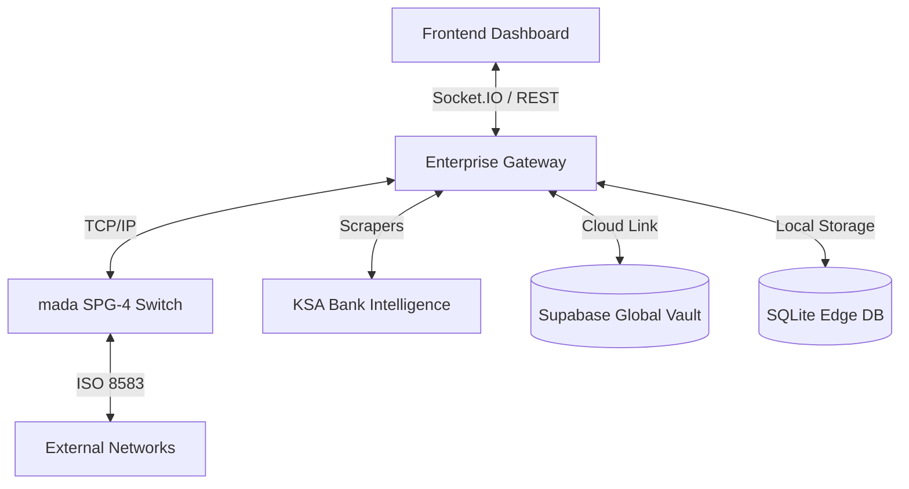

# 🛰️ Enterprise ISO 8583 Intelligence Platform

An elite, production-hardened fintech simulation ecosystem designed for high-fidelity mada/SAMA certification testing, Global FX Aggregation, and Forensic Payment Auditing.

---

## 🏛️ Enterprise Modules

### 1. 🛡️ Security Operations Center (SOC)
- **HSM Enclave Virtualizer**: Visual management of ZMK/TMK/PVK key hierarchies and real-time ARQC/ARPC/MAC generation.
- **Bit-Level XOR Console**: Deep observability into ISO 9564 PIN Block transformations.
- **Immutable Audit Logs**: Tamper-proof transaction logging with dual-sync cloud persistence.

### 2. ⚡ Infrastructure Mission Control
- **Kernel Jitter Waveform**: Real-time visualization of processing latency in the switch core.
- **Network War-Room**: Thermal-mapped stress testing environment for high-TPS throughput validation.
- **Cloud Link Heartbeat**: Live monitoring of the bridge between local nodes and Global Supabase Vaults.

### 3. 💹 Remittance Intelligence Hub
- **Global FX Aggregator**: Real-time market data ingestion from Wise, Frankfurter, and KSA Bank Scrapers.
- **Effective Payout Engine**: Net-recipient calculation logic including spreads, commissions, and corridors.
- **Anitha AI™ Market Pulse**: Cognitive analysis of FX volatility and remittance trends.

### 4. 🎖️ mada Certification Suite (SPG-4)
- **Compliance Auditor**: Automated validation of 128+ formal SAMA test vectors.
- **Certification Runner**: Standalone audit engine (`run_certification.js`) for formal compliance report generation.
- **Forensic Intelligence Vault**: Unified interface for local and global transaction discovery.

---

## 🚀 Quick Start

### 1. Launch the Backend Engine
The backend handles the TCP switch, FX aggregator, and HSM enclave.
```powershell
node server/index.js
```

### 2. Launch the Mission Control UI
The frontend provides the visual intelligence and command dashboards.
```powershell
npm run dev
```
*Note: If port 5173 is busy, the platform will automatically scale to the next available port.*

### 3. Run mada Certification
Execute the formal audit suite to generate a compliance report:
```powershell
node run_certification.js
```

---

## 🏗️ Architecture Matrix



---

## 🔐 Configuration
Ensure your `.env` is configured for Global Intelligence sync:
```env
SUPABASE_URL=your_project_url
SUPABASE_KEY=your_service_role_key
FX_POLLING_INTERVAL=30000
```

**Developed for Enterprise Excellence.**
